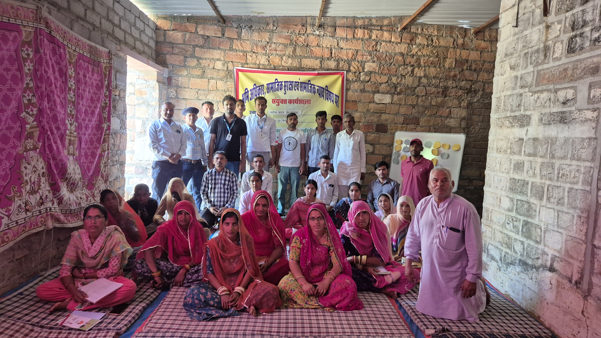

```{=html}

<div id="vssCarousel" class="carousel slide carousel-fade" data-bs-ride="carousel" data-bs-interval="4500" data-bs-pause="false">
  <div class="carousel-indicators">
    <button type="button" data-bs-target="#vssCarousel" data-bs-slide-to="0" class="active"></button>
    <button type="button" data-bs-target="#vssCarousel" data-bs-slide-to="1"></button>
    <button type="button" data-bs-target="#vssCarousel" data-bs-slide-to="2"></button>
    <button type="button" data-bs-target="#vssCarousel" data-bs-slide-to="3"></button>
    <button type="button" data-bs-target="#vssCarousel" data-bs-slide-to="4"></button>
    <button type="button" data-bs-target="#vssCarousel" data-bs-slide-to="5"></button>
  </div>
  <div class="carousel-inner">
    <div class="carousel-item active">
      
      <div class="carousel-caption d-none d-md-block">
        <h2>Rights-Based Work | अधिकार आधारित कार्य</h2>
        <p>Empowering marginalized communities to know and claim their rights and entitlements</p>
      </div>
    </div>
    <div class="carousel-item">
      
      <div class="carousel-caption d-none d-md-block">
        <h2>Livelihood Support | आजीविका आधारित कार्य</h2>
        <p>Sustainable livelihood initiatives across 38 villages in Balotra district, Rajasthan</p>
      </div>
    </div>
    <div class="carousel-item">
      
      <div class="carousel-caption d-none d-md-block">
        <h2>Gram Panchayat Planning | नियोजन</h2>
        <p>Supporting village-level governance and participatory local development planning</p>
      </div>
    </div>
    <div class="carousel-item">
      
      <div class="carousel-caption d-none d-md-block">
        <h2>Women Empowerment | महिला सशक्तिकरण</h2>
        <p>Building the capacities of women, youth and children for a dignified life</p>
      </div>
    </div>
    <div class="carousel-item">
      
    </div>
    <div class="carousel-item">
      
    </div>
  </div>
  <button class="carousel-control-prev" type="button" data-bs-target="#vssCarousel" data-bs-slide="prev">
    <span class="carousel-control-prev-icon"></span>
  </button>
  <button class="carousel-control-next" type="button" data-bs-target="#vssCarousel" data-bs-slide="next">
    <span class="carousel-control-next-icon"></span>
  </button>
</div>

<div class="about-home">
  <h2 class="section-title">Vasundhara Seva Samiti</h2>
  <div class="section-divider"></div>
  
  <p>Vasundhara Seva Samiti, registered under the Rajasthan State Cooperative/Societies Act, 1958, is a non-governmental, non-profit organization working in the rural and drought-prone regions of <strong>Balotra district, Rajasthan.</strong> The organization has been actively engaged in grassroots development initiatives since its registration, with a strong focus on marginalized, deprived, and vulnerable communities.</p>
  
  <p>Founded with the objective of addressing deep-rooted socio-economic challenges, <span class="org-name-highlight">Vasundhara Seva Samiti</span> works to empower women, youth, children, scheduled castes, and economically weaker sections by strengthening their capacities, awareness, and access to rights and resources. The organization believes that sustainable development is possible only when communities are enabled to take charge of their own lives and development processes.</p>
  
  <p>Guided by participatory and rights-based approaches, the Samiti implements need-based and locally relevant development interventions in the areas of livelihood promotion, education, disaster risk reduction, institutional development, community capacity building, environmental awareness, and access to government welfare schemes. The organization actively collaborates with government departments, local self-governments, community-based organizations, and civil society partners to ensure inclusive and long-term impact.</p>
  
  <p><span class="org-name-highlight">Vasundhara Seva Samiti</span> strives to improve the quality of life of rural communities by promoting sustainable livelihoods, social justice, and informed citizenship. By combining traditional community knowledge with practical development strategies, the organization contributes towards inclusive growth and aligns its work with national priorities and the Sustainable Development Goals (SDGs).</p>
  
  <br>
  <a href="about.html" class="btn-vss">Read More About Us</a>&nbsp;&nbsp;
  <a href="contact.html" class="btn-vss-outline">Contact Us</a>
</div>

<div class="focused-areas-section">
  <h2 class="section-title">Focused Thematic Areas of Vasundhara Seva Samiti</h2>
  <div class="section-divider"></div>
  
  <div class="container-fluid px-4 mt-5">
    <div class="row g-4 align-items-start text-center">
      <div class="col-6 col-md-3">
        <div class="focused-area-card p-2 p-md-3">
          <div class="circle-img-wrapper mx-auto mb-3">
            
          </div>
          <h3 class="area-title text-center h5 h4-md">Basic Rights</h3>
          <p class="area-desc small">Supporting communities to access basic rights and entitlements through awareness, outreach, and community-led action.</p>
        </div>
      </div>
      
      <div class="col-6 col-md-3">
        <div class="focused-area-card p-2 p-md-3">
          <div class="circle-img-wrapper mx-auto mb-3">
            
          </div>
          <h3 class="area-title text-center h5 h4-md">Livelihood</h3>
          <p class="area-desc small">Promoting sustainable livelihoods through skills training, local planning, and connecting families with support schemes.</p>
        </div>
      </div>
      
      <div class="col-6 col-md-3">
        <div class="focused-area-card p-2 p-md-3">
          <div class="circle-img-wrapper mx-auto mb-3">
            
          </div>
          <h3 class="area-title text-center h5 h4-md">Disaster Management</h3>
          <p class="area-desc small">Building preparedness and community response capacity to reduce disaster risk and protect vulnerable families.</p>
        </div>
      </div>

      <div class="col-6 col-md-3">
        <div class="focused-area-card p-2 p-md-3">
          <div class="circle-img-wrapper mx-auto mb-3">
            
          </div>
          <h3 class="area-title text-center h5 h4-md">Capacity Building</h3>
          <p class="area-desc small">Strengthening institutions, community leaders, and grassroots workers through training and mentoring.</p>
        </div>
      </div>
    </div>
  </div>
</div>

<div class="reach-section">
  <h2 class="section-title text-center">Vasundhara Seva Samiti's Reach</h2>
  <div class="section-divider"></div>

  <div class="reach-container">
    <div class="reach-grid">
      <div class="reach-item">
        <div class="reach-card card-pattern-1">
          <div class="reach-number" data-target="1">0</div>
          <div class="reach-label">States</div>
        </div>
      </div>
      <div class="reach-item">
        <div class="reach-card card-pattern-2">
          <div class="reach-number" data-target="2">0</div>
          <div class="reach-label">Districts</div>
        </div>
      </div>
      <div class="reach-item">
        <div class="reach-card card-pattern-3">
          <div class="reach-number" data-target="13">0</div>
          <div class="reach-label">Gram Panchayats</div>
        </div>
      </div>
      <div class="reach-item">
        <div class="reach-card card-pattern-4">
          <div class="reach-number" data-target="130000">0</div>
          <div class="reach-label">Families</div>
        </div>
      </div>
    </div>
  </div>
</div>

<script>
document.addEventListener("DOMContentLoaded", function() {
  const observer = new IntersectionObserver((entries) => {
    entries.forEach((entry) => {
      if (entry.isIntersecting) {
        const counters = entry.target.querySelectorAll(".reach-number");
        counters.forEach((counter) => {
          const target = +counter.getAttribute("data-target");
          const duration = 2000; // 2 seconds animation
          const increment = target / (duration / 16); 
          
          let current = 0;
          const updateCounter = () => {
            current += increment;
            if (current < target) {
              counter.innerText = Math.ceil(current).toLocaleString("en-IN");
              requestAnimationFrame(updateCounter);
            } else {
              counter.innerText = target.toLocaleString("en-IN");
            }
          };
          updateCounter();
        });
        observer.unobserve(entry.target);
      }
    });
  }, { threshold: 0.5 });

  const section = document.querySelector(".reach-section");
  if (section) observer.observe(section);
});
</script>

<div style="background:#f0f7f0;padding:60px 30px;">
  <h2 class="section-title">Recent Projects</h2>
  <div class="section-divider"></div>
  <div class="container-fluid px-4 mt-4">
    <div class="row g-4">
      <div class="col-md-4">
        <div class="project-card">
          <div class="card-top"></div>
          <div class="card-body-inner">
            <h5>Philanthropy</h5>
            <p>Community welfare and philanthropic initiatives supporting the most vulnerable families across Balotra district - providing essential support, resources, and care to those in need.</p>
            <a href="achievements.html" class="btn-vss-outline" style="margin-top:10px;font-size:0.85rem;">Know More</a>
          </div>
        </div>
      </div>
      <div class="col-md-4">
        <div class="project-card">
          <div class="card-top"></div>
          <div class="card-body-inner">
            <h5>Planning in Gram Panchayat | नियोजन</h5>
            <p>Supporting Gram Panchayat-level participatory planning and local development processes across 13 Gram Panchayats, enabling communities to lead their own development.</p>
            <a href="achievements.html" class="btn-vss-outline" style="margin-top:10px;font-size:0.85rem;">Know More</a>
          </div>
        </div>
      </div>
      <div class="col-md-4">
        <div class="project-card">
          <div class="card-top"></div>
          <div class="card-body-inner">
            <h5>Organizational Development | संगठनात्मक विकास</h5>
            <p>Strengthening community-based institutions, civil society organizations, and grassroots groups to ensure sustained, long-term impact in rural development activities.</p>
            <a href="achievements.html" class="btn-vss-outline" style="margin-top:10px;font-size:0.85rem;">Know More</a>
          </div>
        </div>
      </div>
    </div>
  </div>
</div>

<div style="background:#f0f7f0;padding:60px 30px;">
  <h2 class="section-title">Blog & News Articles</h2>
  <div class="section-divider"></div>
  <div class="container-fluid px-4 mt-4">
    <div class="row g-4">
      <div class="col-md-4">
        <div class="blog-card">
          <div class="blog-top">Community Development</div>
          <div class="blog-body">
            <h5>Community Participation in Gram Panchayat Planning</h5>
            <p>VSS successfully supported village-level participatory planning processes across 13 Gram Panchayats in Balotra district, ensuring local voices shape local development.</p>
            <a href="achievements.html" class="btn-vss-outline" style="font-size:0.82rem;">Read More</a>
          </div>
        </div>
      </div>
      <div class="col-md-4">
        <div class="blog-card">
          <div class="blog-top">Women Empowerment</div>
          <div class="blog-body">
            <h5>Awareness Programs on Women's Rights in Rural Rajasthan</h5>
            <p>The organization conducted awareness programs and community meetings across 38 villages on child marriage, dowry, and women's entitlements under government schemes.</p>
            <a href="achievements.html" class="btn-vss-outline" style="font-size:0.82rem;">Read More</a>
          </div>
        </div>
      </div>
      <div class="col-md-4">
        <div class="blog-card">
          <div class="blog-top">Livelihood</div>
          <div class="blog-body">
            <h5>Livelihood Support and Education Awareness Initiatives</h5>
            <p>Through targeted livelihood programs and education awareness campaigns, VSS has enabled hundreds of families across Balotra to access government schemes.</p>
            <a href="achievements.html" class="btn-vss-outline" style="font-size:0.82rem;">Read More</a>
          </div>
        </div>
      </div>
    </div>
  </div>
</div>

<div style="padding:60px 30px;background:#fff;text-align:center;">
  <div class="container" style="max-width:700px;margin:0 auto;">
    <div class="donate-box">
      <h4>🤝 Help Us | हमारी मदद करें</h4>
      <p>Your support helps Vasundhara Seva Samiti continue its work with marginalized communities in Balotra, Rajasthan. You can contribute through donations or volunteering your time and skills.</p>
      <a href="career.html" class="btn-donate">Donate / Volunteer</a>
    </div>
  </div>
</div>
```
